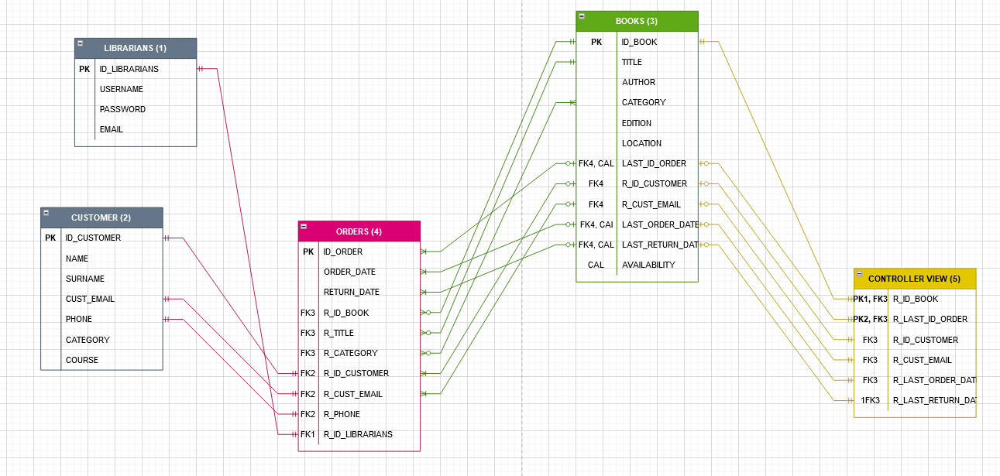
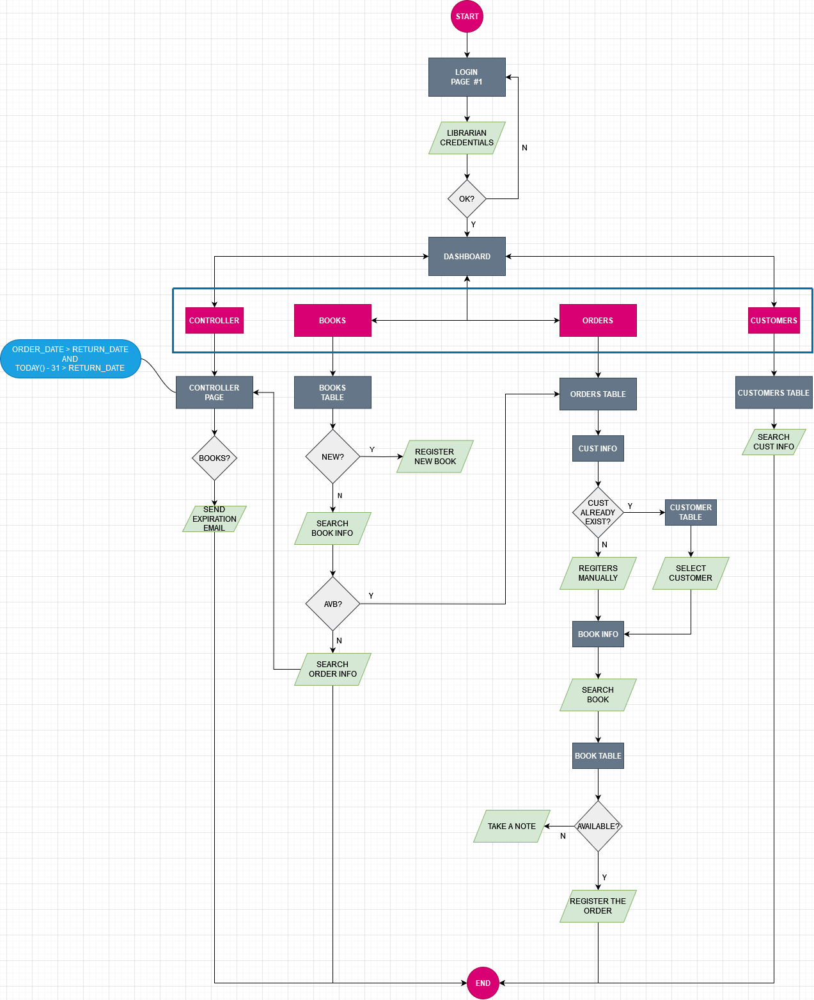

<p align="center"><a href="https://laravel.com" target="_blank"></a></p>

<p align="center">
<a href="https://travis-ci.org/laravel/framework"></a>
<a href="https://packagist.org/packages/laravel/framework"></a>
<a href="https://packagist.org/packages/laravel/framework"></a>
<a href="https://packagist.org/packages/laravel/framework"></a>
</p>

# DB Schema - Library Management System


## Tables:
-	LIBRARIANS
-	CUSTOMER
-	BOOKS
-	ORDERS

## Views:
-	CONTROLLER

---
**LIBRARIANS**

    ID_LIBRARIANS char(8), auto_increment
    USERNAME varchar(15), not null
	PASSWORD varchar(8), not null
	EMAIL varchar(60), not null

This table stores information about libriarians profile that use the library management system.

---
**CUSTOMERS**

    ID_CUSTOMER char(8), auto_increment, not null
	NAME varchar(50), not null
	SURNAME varchar(50), not null
	CUST_EMAIL varchar(60), not null
	PHONE varchar(15), not null
	CATEGORY varchar(35), not null
	COURSE varchar(100), null

This table stores information about customers profile registered into the system. In this table are stored student and generic customer like teachers and employees as well. We can distinct those thanks the CATEGORY column.

---
**BOOKS**

    ID_BOOK char(8), auto_increment, not null
	TITLE varchar(250), not null
	AUTHOR varchar(100), not null
	CATEGORY varchar(35), not null
	EDITION varchar(35), null
	LOCATION char(15), not null
	LAST_ID_ORDER char(15), null
	R_ID_CUSTOMER char(8), null
	R_CUST_EMAIL varchar(60), null
	LAST_ORDER_DATE datetime(23), null
	LAST_RETURN_DATE datetime(23), null
	AVAILABILITY bool, not null

This is the main table. We have information about books stored in the library with their specific LOCATION in the warehouse. This could help librarians and customer in order to find quickly the desired books.

We have information of the availability of the books, thanks to the calculated column AVAILABILITY (Y/N):

```
If LAST_RETURN_DATE < LAST_ORDER_DATE:
    AVAILABILITY = ‘N’
else:
    AVAILABILITY = ‘Y’
```

Foreign Keys:
-	LAST_ID_ORDER one optional to many from ORDERS table (take only the last record registered)
-	R_ID_CUSTOMER one optional to many from ORDERS table
-	R_CUST_EMAIL one optional to many from ORDERS table
-	LAST_ORDER_DATE one optional to many from ORDERS table (take only the last record registered)
-	LAST_RETURN_DATE one optional to many from ORDERS table (take only the last record registered)
    
---

**ORDERS**

	ID_ORDER char(15), auto_increment, not null
	ORDER_DATE datetime(23), not null
	RETURN_DATE datetime(23), null
	R_ID_BOOK char(8), not null
	R_TITLE varchar(50), not null
	R_CATEGORY varchar(35), not null
	R_ID_CUSTOMER char(8), not null
	R_CUST_EMAIL varchar(60), not null
	R_PHONE varchar(15), not null
	R_ID_LIBRARIANS char(8), not null

This table store information about the orders placed from the order form. Take information from different tables.

Foreign keys:
-	R_ID_BOOK many optional to one from BOOKS table
-	R_TITLE many optional to one from BOOKS table
-	R_CATEGORY many optional to one from BOOKS table
-	R_ID_CUSTOMER one to one from CUSTOMERS table
-	R_PHONE one to one from CUSTOMERS table
-	R_ID_LIBRARIANS one to one from LIBRARIANS table

---
**CONTROLLER**

	R_ID_BOOK char(8), not null
	R_LAST_ID_ORDER char(15), not null
	R_ID_CUSTOMER char(8), not null
	R_CUST_EMAIL varchar(60), not null
	R_LAST_ORDER_DATE datetime(23), not null
	LAST_RETURN_DATE datetime(23), not null
	
This view helps users to visualize only the book that are borrowed longer then 31 days and took this kind of information from the BOOK table.

```
If LAST_ORDER_DATE > LAST_RETURN_DATE and TODAY() - 31 > LAST_RETURN_DATE:
    action -> expiration_email
```




---
# Flowchart

